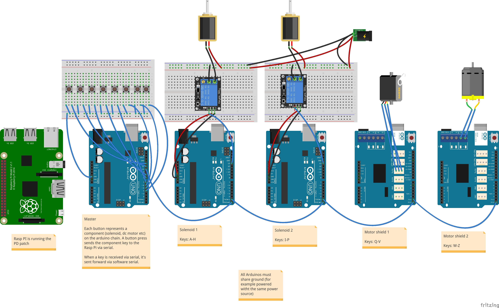
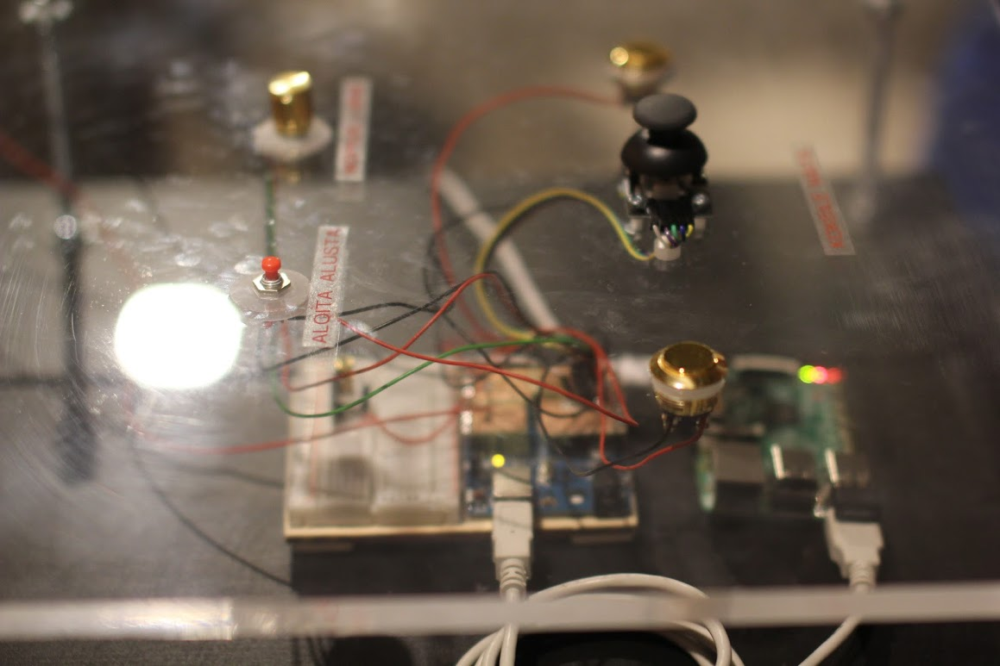
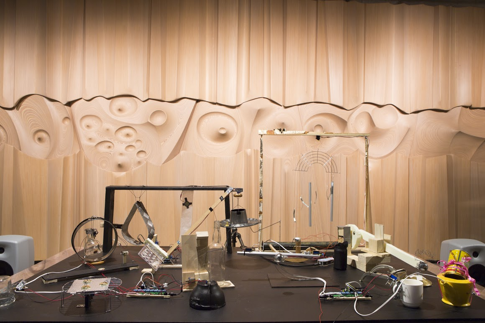
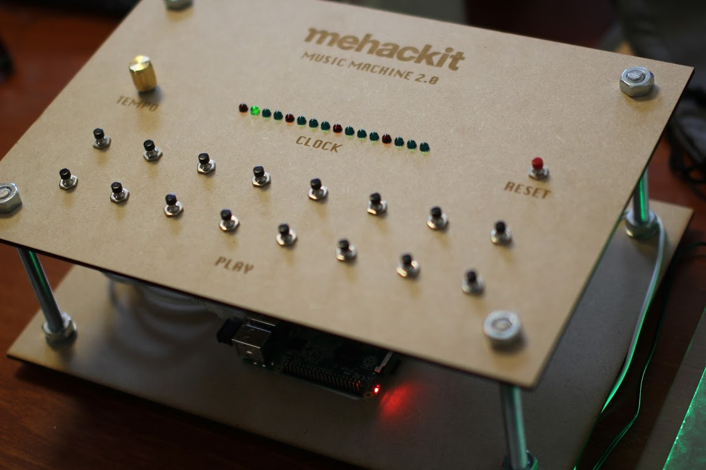
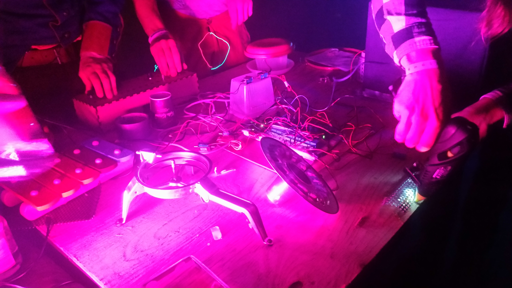

# Mehackit Music Machine

## V1

https://vimeo.com/158470330

The first incarnation of the Mehackit music machine was at the Espoo Museum of Modern Art during the Mehackit Art Hack event. 

There's a Pure Data sequencer running on the Raspberry Pi, that sends serial messages to the chan of Arduinos. Each arduino checks if the message belongs to them and either triggers a corresponding solenoid/motor or passes the message forward.

 The controller looked like this:

 

This is the finished installation:

## V2

New version of the music machine, now with more buttons!

## V3

New version of the music machine, now with less buttons! 

https://vimeo.com/194648696

This version has four knobs that each control a pair of solenoids. The knobs choose from 10 different predefined patterns. The patterns mimic house-like kick, snare, hi-hat and percussion patterns.

## 

The inspiration came from a Max for Live device called Instant Haus by Alexkid. The aim for the controller is to make the installation sound good immediately when a user twists the knobs but still offer enough control to express themselves and play the installation.

This version uses Teensy 3.0 to read the knobs. The Teensy is set up as an USB-MIDI device so it communicates with the Pure Data patch running on Raspberry Pi via MIDI. The Pd-patch then sends the 'notes' to the Arduino as chars via serial.